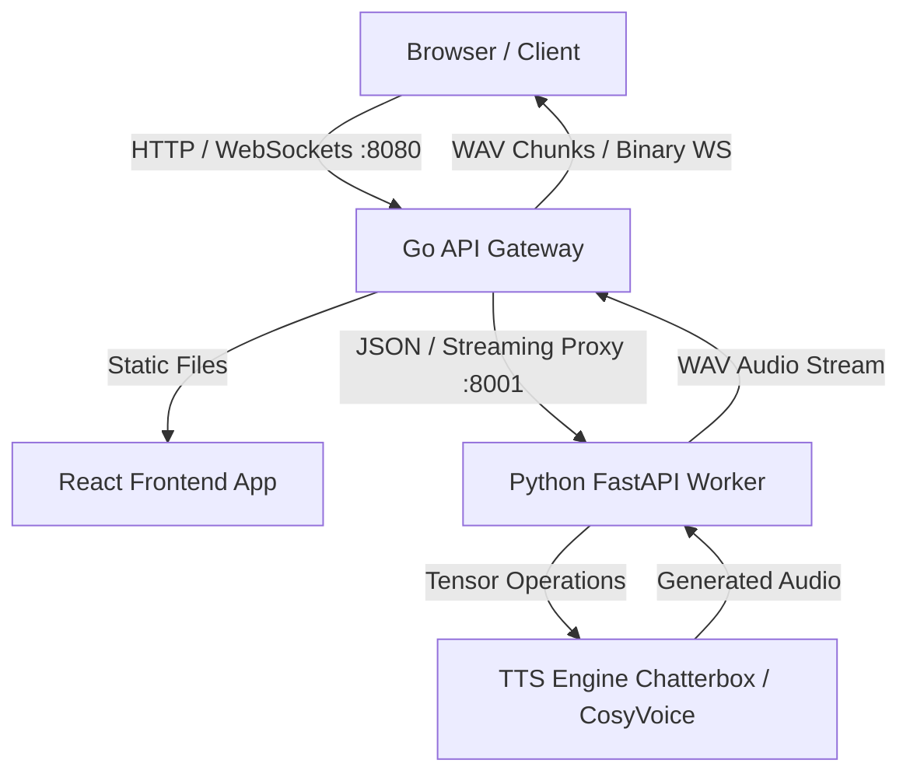

# 🎙️ TTS One-Click

One-command installation for state-of-the-art, low-latency text-to-speech and zero-shot voice cloning.

[](LICENSE)
[](https://go.dev)
[](https://www.python.org)
[](https://react.dev)
[](https://www.docker.com)
[](#platform-support)

---

TTS One-Click simplifies deploying state-of-the-art TTS models. With a unified Go gateway proxying optimized Python inference engines and a beautiful React dashboard, you can get high-fidelity text-to-speech and voice cloning running locally on your hardware in seconds.

## ✨ Features

- **🚀 One-Command Installation:** Automatically checks system prerequisites, configures Python virtual environments, downloads model weights, and compiles the Go gateway.
- **🎭 Zero-Shot Voice Cloning:** Clone target voices using only 3 to 10 seconds of reference audio (MP3 or WAV).
- **⚡ Dual Engine Choices:**
  - **Chatterbox-Turbo:** Tailored for fast English TTS, running comfortably on lower VRAM.
  - **CosyVoice3:** Natural multilingual TTS with high-quality inflections.
- **🔄 Go API Gateway:** A high-performance HTTP & WebSocket gateway balancing traffic, serving static assets, and managing Python backends.
- **📊 Real-time Dashboard:** Built-in React user interface to play synthesized speech, upload clone samples, and inspect live performance metrics (RTF, TTFT, queue latency).

---

## 🛠️ Quick Start

### Local Setup
Get started on your system with three simple commands:

```bash
# 1. Clone the repository
git clone https://github.com/fahimulhaque/tts-one-click.git
cd tts-one-click

# 2. Run the interactive installer (selects engine, downloads weights, builds UI & Go server)
./install.sh

# 3. Start the unified server
./tts-server
```
Now open [http://localhost:8080](http://localhost:8080) in your browser.

### Docker Setup
To run using Docker Compose:

```bash
# Run Chatterbox-Turbo
MODEL=chatterbox docker compose -f docker/docker-compose.yml up

# Run CosyVoice3
MODEL=cosyvoice docker compose -f docker/docker-compose.yml up
```

---

## 📐 Architecture

TTS One-Click uses a hybrid architecture, pairing Go's high-concurrency network handling with Python's deep-learning ecosystem.



---

## 📊 Model Comparison

| Model | Parameters | Languages | Voice Cloning | Min VRAM | Primary Strength |
| :--- | :---: | :---: | :---: | :---: | :--- |
| **Chatterbox-Turbo** | 350M | English | Yes | 4GB | Optimized for real-time throughput & low VRAM |
| **CosyVoice3** | — | Multilingual | Yes (zero-shot) | 4GB | Superior natural speech prosody & accents |

---

## 🔌 API Overview

Detailed HTTP endpoint routing provided by the Go Gateway:

| Method | Endpoint | Description | Payload Format |
| :--- | :--- | :--- | :--- |
| `POST` | `/api/v1/tts` | Synthesizes text to audio | JSON |
| `POST` | `/api/v1/clone` | Performs zero-shot voice cloning | Multipart Form |
| `GET` | `/api/v1/health` | Gateway & Python worker status | — |
| `GET` | `/api/v1/metrics` | Returns RTF, TTFT, and throughput stats | — |
| `WS` | `/ws/tts` | Streaming speech generation socket | Text / Binary |

> [!NOTE]
> Read the [Installation & API Reference Guide (INSTALL.md)](INSTALL.md) for full endpoint request/response payloads, field validations, and custom configurations.

---

## 💻 Platform Support

- **Ubuntu:** 20.04+, 22.04 LTS (with CUDA support)
- **macOS:** Apple Silicon (M1/M2/M3/M4 via MPS hardware acceleration)
- **Windows:** WSL2 (Ubuntu 20.04/22.04) with CUDA pass-through
- **Google Colab:** Test directly inside our [Google Colab Notebook](notebooks/colab_install.ipynb)
- **Docker:** Multi-stage image setups with CPU and GPU support

---

## 🤝 Contributing

Contributions are welcome! Please read the [Contributor's Guide (CONTRIBUTING.md)](CONTRIBUTING.md) to understand how to set up local environments, run tests, and add custom TTS engine adapters.

## 📄 License

Distributed under the MIT License. See [LICENSE](LICENSE) for more details.
